**Muhammad Syahirul Khaliq bin Mohamed Aidi Shahriz**

**22075208**

**Github link:** <https://github.com/Syahirulkhaliq/Khaliq_22075208/>

# Customer Behaviour Analysis via Churn on E-commerce dataset

# Introduction

Customer behavior analysis in e-commerce is crucial as it provides insights into shopping patterns, preferences, and decision-making processes of customers. By understanding these behaviors, e-commerce businesses can develop their marketing strategies, improve customer experiences, and enhance product offerings. This analysis is key to customer retention, optimizing sales techniques, and driving business growth in a highly competitive digital marketplace. Effective customer behavior analysis leads to more personalized, efficient, and engaging online shopping experiences, directly impacting customer satisfaction and loyalty.

SAS Enterprise Miner is a powerful tool for customer behavior analysis in e-commerce. It streamlines data preprocessing, effectively handling issues like missing data and outliers. The software provides a range of modeling techniques, such as decision trees and neural networks, to gain deep insights into customer behaviors. Its segmentation and profiling capabilities aid in identifying different customer groups, facilitating targeted marketing. SAS Enterprise Miner's ability to process large datasets efficiently makes it ideal for e-commerce applications. Moreover, it offers intuitive graphical outputs for result interpretation, crucial for informed business decision-making.

# Dataset Overview and objective

Dataset consists of 1020 rows of unique customers and 13 attributes
which are Customer ID, Gender, Age, City, Membership Type, Total Spend,
Items Purchased, FavoriteCategory, Average Rating, Discount Applied,
Days Since Last Purchase, Satisfaction Level and Churn. Below are the
details of the attributes:

  Customer_ID                (Numeric)     :  A unique identifier assigned to each
                                           customer, ensuring distinction across
                                           the dataset

  Gender                     (Categorical) :  Specifies the gender of the customer,
                                           allowing for gender-based analytics

  Age                        (Numeric)     :  Represents the age of the customer,
                                           enabling age-group-specific insights.

  City                       (Categorical) :  Indicates the city of residence for
                                           each customer, providing geographic
                                           insights

  Membership_Type            (Categorical) :  Identifies the type of membership held
                                           by the customer, influencing perks and
                                           benefits

  Total_Spend                (Numeric)     :  Records the total monetary expenditure
                                           by the customer on the e-commerce
                                           platform

  Items_Purchased            (Numeric)     :  Quantifies the total number of items
                                           purchased by the customer

  FavoriteCategory           (Categorical) :  Records most-explored category of a
                                           user, represents customer biasness
                                           towards products

  Average_Rating             (Numeric)     :  Represents the average rating given by
                                           the customer for purchased items,
                                           gauging satisfaction

  Discount_Applied           (Boolean)     :  Indicates whether a discount was
                                           applied to the customer\'s purchase,
                                           influencing buying behavior

  Days_Since_Last_Purchase   (Numeric)     :  Reflects the number of days elapsed
                                           since the customer\'s most recent
                                           purchase, aiding in retention analysis

  Satisfaction_Level         (Categorical) :  Captures the overall satisfaction
                                           level of the customer, providing a
                                           subjective measure of their experience

  Churn                      (Numeric)     :  A binary column indicating whether the
                                           customer has churned (0 for retained,
                                           1 for churned), indicating customer
                                           retention
 

Based on the dataset, \"Churn\" variable is the most suitable target
variable. This is because it directly relates to customer retention, a
key aspect of understanding and predicting customer behaviour. By
analysing churn, you can identify patterns and factors that indicate
whether a customer is likely to stop purchasing (churn) or continue
being active. Analyzing churn can provide valuable insights into
customer loyalty, satisfaction, and overall engagement with the
e-commerce platform. It can also help in developing strategies to
improve customer retention and targeting interventions to reduce the
churn rate. Thus, objective of this study to:

-   Analyse the customer behaviour dataset and derived meaningful
    insights from the model analysis

-   Assess and compare the performance of models which can emphasize the
    reliability of the insights develop

In this study, SAS Enterprise Miner will be mainly utilised to extract
information for the following objectives with the inclusion of other
tools such as Talend Data Prep.

# Dataset Import and Preprocessing

Prior from using SAS Enterprise Miner, Talend Data Preparation was
utilized to provide comprehensive details on dataset, ensure data
consistency of categorical data values such as spelling errors and
alphabet casing, as well as checking missing values. There were some
data inconsistencies that can be group using "Find and group similar
text" function in city column as below:

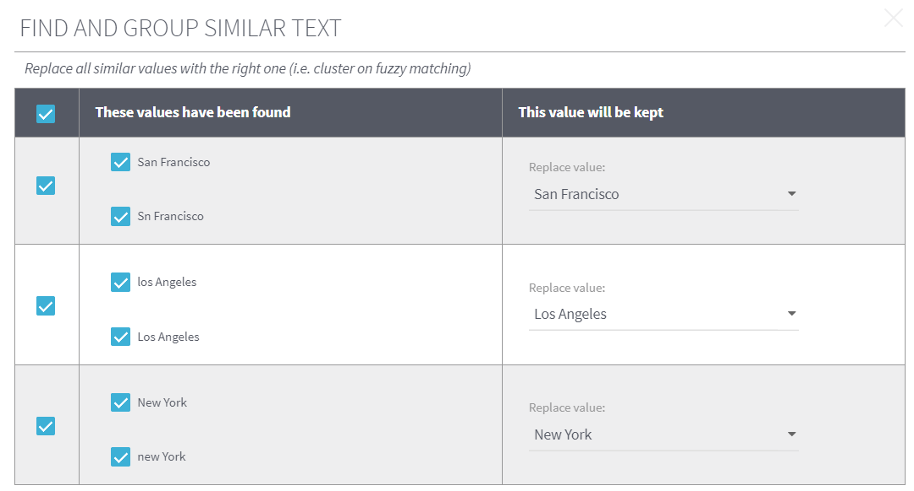

Such approach would be easier to conduct in Talend Data Preparation
compared to SAS. In addition, missing values were detected in 'Age' and
'Satisfaction Level' column as shown below:

<u>Age Column</u>

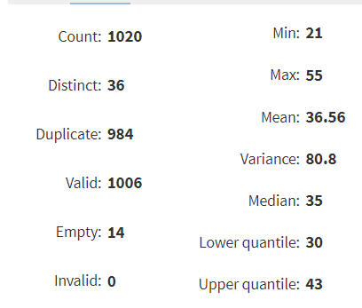

<u>'Satisfaction Level' Column</u>

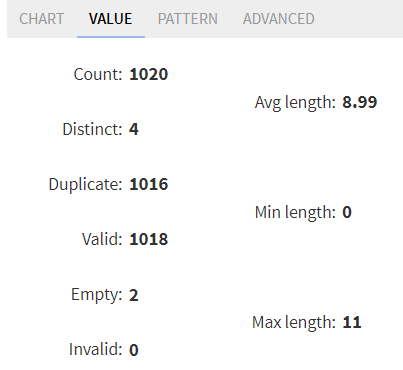

Considering the amount of dataset rows to be quite limited, imputation
method is preferable in comparison with deleting rows to prevent the
loss of data. Such method will be implied in SAS Enterprise Miner. In
addition, columns containing 2 unique values like 'Gender' and 'Discount
Applied' was duplicated, and the duplicated columns were replace with
binary values using 'replace the cells that match' function with below
as an example:

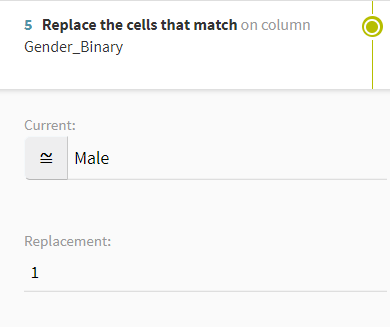

For 'Gender' column, 'Male' value represents as 1 while 'Female' value
represents as 0. While for 'Discount Applied' column, 'TRUE' value
represents as 1 while 'FALSE' value represents as 0. The result of
columns are as below:

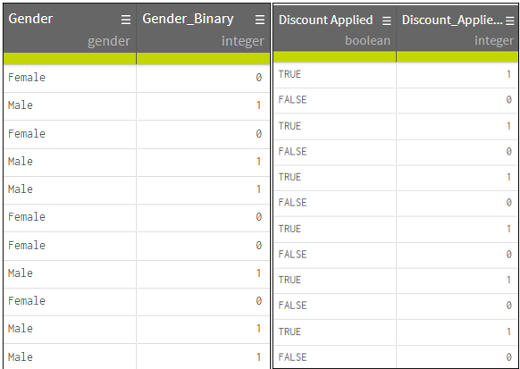

The dataset was then exported to be imported in SAS for further
preprocessing. Below are the SAS Workflow diagram:

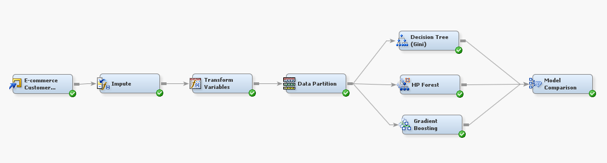

The file was imported via 'File import' node. Considering the dataset
consists of only 1020 rows, no sampling was needed as dataset itself
will be considered as representation. Details of initial roles were as
below:

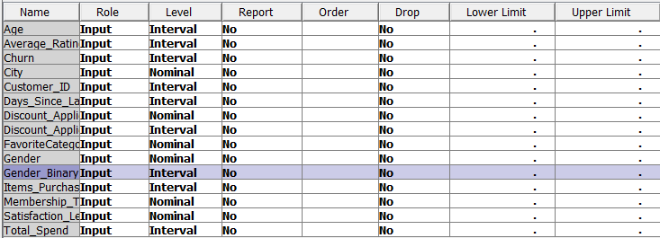

In the 'edit variable' section of file import. Minor changes were
conducted in terms of role and level. Churn was selected as the target
variable for customer behaviour analysis while Customer_ID role was
changed to ID. The role of nominal level columns of Discount_Applied and
Gender were set to rejected to prevent redundancy with the modified
columns of these 2 columns. In addition, the level of
Discount_Applied_Binary, Gender_Binary and Churn were set to Binary due
to its binary value. Below are the overall changes made:

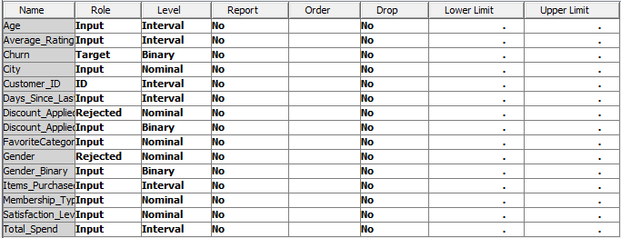

A quick exploration on attributes was conducted via choosing every
related attributes in 'edit variable' section and clicking 'explore'.
Below are some visualizations of the exploration:

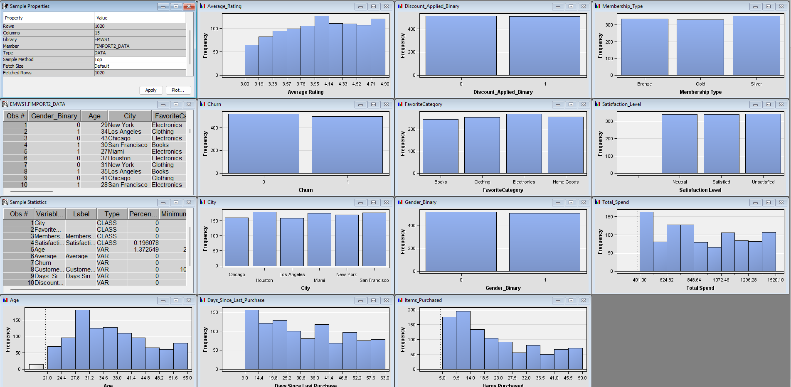

Based on the graphs, there is opportunity to perform log transformation
for skewed distribution, particularly 'Age' and 'Items_Purchased'
attribute. Log transformation smoothens the data for better
distribution. In handling the missing values, imputation method was
selected by using the impute node as in SAS workflow diagram. In the
edit variable section, the 'Use' column were changed to 'Yes' for 'Age'
and 'Satisfaction_Level'. Considering the missing value type is missing
completely at random (MCAR) as well as having low count (only 14 for
'Age' and 2 for 'Satisfaction_Level'), the method of imputation was set
to Mean and Count respectively. Below are the changes made:

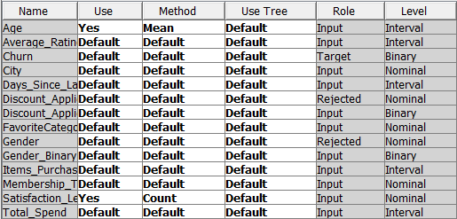

Below is the output after running impute node:

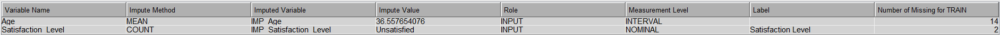

After that, 'Transform Variable' node was connected to normalize data
via performing log transformation. This can be done on edit variable
section of Transform variable node such as below:

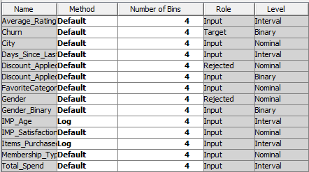

The result of transformation is indicated as below:

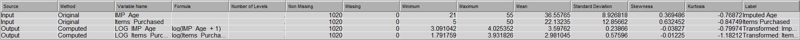

The reduction in standard deviation and skewness of indicates a better
distribution of the transformed attributes. The higher negative value of
Kurtosis for transformed 'Item_Purchased' attributes indicates fewer
outliers and less extreme values in dataset.

# Data Partition process

Dataset must undergo partition into Training, validation and test set.
Data partition node was dragged and connected to impute node from
previous data preprocessing. In this case, dataset was only divide into
training (80%) and test set (20%) due to limited dataset amount.
Partitioning method was set to simple random method as every data points
have equal chance to be selected, subsequently reducing biasness. Below
are details of data partition process:

# Data Modelling and Analysis

## Decision Tree Model

Since the target variable is binary, Gini is used as target criterion as
it is effective in binary classification as it is fast to be computed.
The maximum depth was limited to 3 to provide main overview of the
important details of customer behaviour. Below are the decision tree
details:

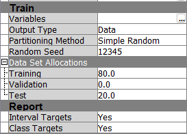

From the decision tree formed, this indicates that favorite category
affects the most outcome of Churn. While electronics from category are
mainly impacted by cities bought, other category mainly being impacted
by age. While age is either impacted by average rating if log age
\<3.314, or number of items purchased if it is more than or equal to
3.314. From the cities that impacted electronics, Houston and Chicago
city is dependent on age as well.

There a few strategies that can be developed from this model:

1.  Target customers in specific cities like Houston and Chicago with
    electronics, as city location appears to be a significant factor for
    this category

2.  For other categories, age seems to be the most significant factor.
    Marketing and product recommendations can be age-specific to cater
    to different preferences.

3.  Lower age groups can focus on higher rating products as it is
    heavily influenced from it. For higher age groups, items purchased
    seems to be a significant factor. Strategies like bundle offers can
    be introduced for higher volume purchasing

4.  Since electronics are more influenced based on cities, company can
    adjust stock inventory to these locations

## Bagging using High Performance Random Forest (HP Random Forest)

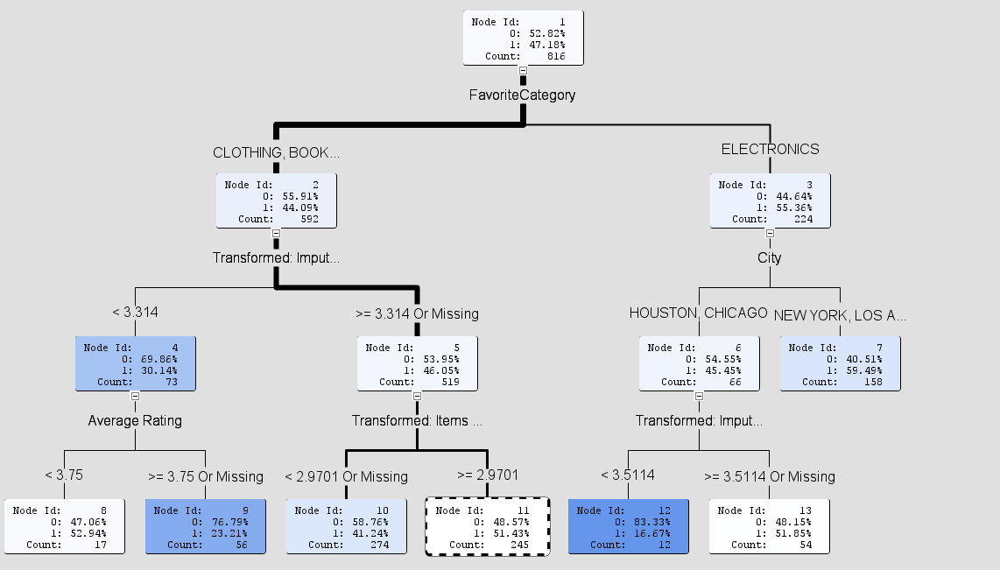

The variable importance indicated that Gender_Binary, FavoriteCategory,
Discount_Applied_Binary and Age are the top 4 attributes of the
importance. These provides details of insights for strategic business
such as:

1.  Strong influence of gender bias indicates necessity of creating
    gender-based marketing campaigns

2.  Promoting products that are categorical based on the
    customers/users' favourite. These can increase engagement of users
    and prevent churning

3.  Analyse effectiveness of discounts and considering personal ones as
    well

## Boosting using Gradient Boosting Decision Trees

Gradient boosting tree is a great approach as it corrects the error of
previous tree decision under a number of iterations until it reaches its
minimum loss function. Different iterations were implied and tested to
find its minimal globalization, which is around 189 iterations. Thus, it
is used in case study. The variable indicator based on result running is
as below:

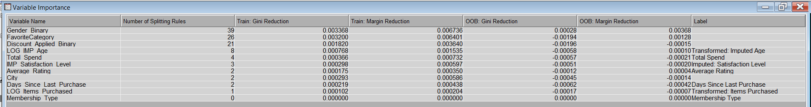

As indicated, the top 5 main factors influencing such result would be
'total spend', 'Day Since Last Purchase', 'Items Purchased', 'City' and
'Age'. Thus, such strategies that can be implied in business strategy
would be:

1.  Target customers who have spent more but have not purchased recently
    with personalized offers or reminders

2.  Develop loyalty programs to reward repeat purchases, thereby
    reducing the likelihood of churn.

3.  Develop strategies to local tastes and purchasing habits, possibly
    reflecting regional differences and different age

## Models' comparison based on performance metrics

The model comparison node was utilized the compare the performance of
tree models utilized

### Classification table

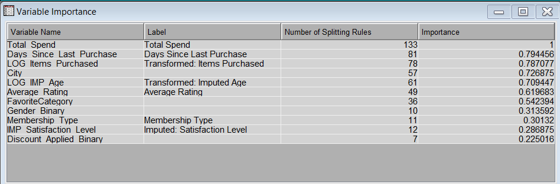

Classification table involves 4 labels, which are True Positive, True
Negative, False Positive, False Negative. These are the description of
these 4 labels in terms of churn analysis:

-   True Positive (TP): Indicates the customers who were predicted to
    churn and did churn. It helps to understand the effectiveness of
    retention strategies targeted at at-risk customers.

-   True Negative (TN): Represents customers who were predicted to stay
    and did stay. It shows the accuracy of the model in identifying
    loyal customers.

-   False Positive (FP): Customers who were predicted to churn but did
    not churn. This could lead to unnecessary spending on retention
    efforts or incentives for customers who were not at risk

-   False Negative (FN): Customers who were not identified as at-risk
    but churned. This is a missed opportunity for intervention to retain
    the customer

FN is the most important label in this aspect as it describes the
failure of capturing potential customers that will churn. While other
labels are important as well, FN is the main focus on this evaluation.

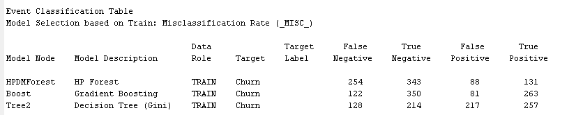

Based on training dataset classification table , HP Forest model is the
least suitable model in predicting churn risk as it generates FN more
than 2 times the amount of both Gradient Boosting and Decision Tree
respectively. In addition, Gradient boosting is the most suitable model
in prediction of churn risk with the lowest FN of 122 followed by
Decision Tree with 128

### Evaluation Metrices

This will involve comparison based on few metrices based on model in
both trained and test data

<u>Trained Data</u>

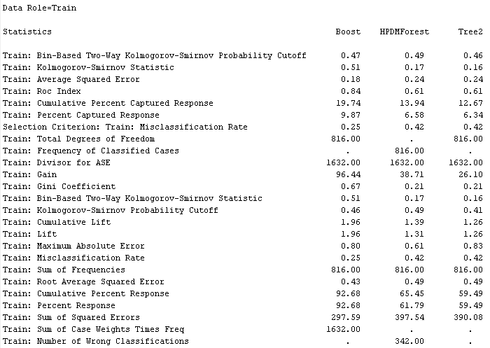

Overall, Gradient Boosting decision tree is significantly the better
model compared to decision tree and HP random forest as it has a
relatively lower misclassification rate, sum of squared error, as well
as higher gini coefficient in comparison to HP Random Forest and
Decision Tree model. This indicates that gradient boosting likely better
to handle noise in data, overfitting issues, and provide better
prediction accuracy.

<u>Test Data</u>
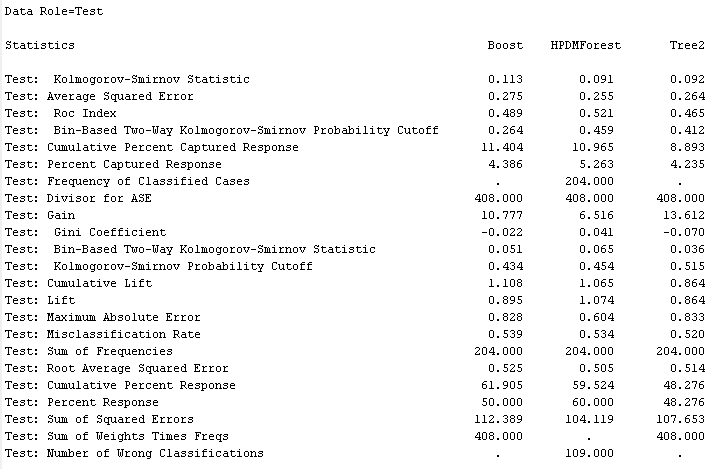

However, for test dataset, Gradient Boost have a higher
misclassification rate, sum of squared errors with lower gini
coefficient compared to the other two models. This might indicate the
model being overfitting. While Decision Tree has the lowest
misclassification rate providing a better prediction accuracy, HP Random
Forest produces the highest gini coefficient and lowest sum of squared
errors.

### ROC Chart

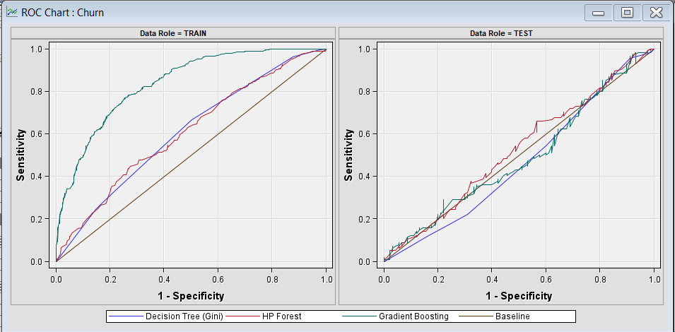

ROC curve provides indication on models predictive ability with higher
area under curve (AUC) indicates better ability of predicting. In train
dataset, it is depicted that all three models AUC is above the baseline,
indicating its reliability on developing a reliable prediction model.
However, different trend was seen in test dataset, with Gradient
boosting and Decision Tree model covers below the baseline with only HP
random forest barely covering above the baseline. This indicates poor
performance of prediction test dataset. This indicates high possibility
of outliers and noise as models learned the data too well, and unable to
generalize to new and unseen data. Generalizability issues are related a
few aspects such as:

1.  Limited amount of dataset to capture overall representation of the
    analysis

2.  High complexity of the model, which needs to be reduced

3.  Lack of more generalized training methods such as utilization of
    cross validation technique

Thus, these limitations can be address for further studies

# Conclusion

Based on the data preprocessing and modelling, certain insights can be
gained from the customer behaviour analysis which includes:

-   Localized and Demographic Targeting: Develip marketing strategies
    for electronics in cities like Houston and Chicago and align product
    recommendations with age-specific preferences for other categories.

-   Personalized Engagement: Implement gender-specific campaigns and
    promote items based on individual customer\'s favourite categories
    to enhance user engagement.

-   Incentive Programs: Conduct analysis on the significance of
    discounts and introduce personalized offers, reminders, and loyalty
    programs to encourage repeat purchases and higher spend.

-   Inventory and Marketing Optimization: Adjust inventory such as
    electronics in specific cities and use bundle offers for higher age
    groups to incentivize volume purchases.

Based on the performance evaluation, Gradient boosting decision tree
provides the best model on training dataset. However, due to possibility
of outliers and noise, as well as limited amount of dataset, the model
provided is overfitted. This indicates further study with dataset with
better representation, different models of different complexities, as
well as different training approach such as cross validation technique.

# Challenges of Study #

Due to time constraints, the study couldn't employ advanced pre-processing techniques like sequence analysis, which would track the order of items purchased. This can potentially revealing patterns in customer behavior over time.Similarly, association rule mining, which might uncover relationships between categorical variables such as New York city is frequently related to electronics. This analysis can provide a strategic business target to boosts products sale. Additionally, the study's model generalizability is limited as it relies on a single dataset. Incorporating multiple data sources could enhance the model's robustness, making its predictions more reliable across different customer segments and shopping platforms. Also, multiple data sources would provide a greater challenges and opportunity to learn such which includes:

1. Data integration
Different data sources provides different structure and attributes. This may provide more on a real-life example of conducting customer behaviour analysis as data normally does not come from one source. Additionally, option in tackling challenges such as aligning format from each sources using Talend Data Integration may be presented in this case study.

2. Data Quality and Consistency
Data source presented in this study are considered quite clean and consistent despite few noises and missing values are detected. These qualities are the opposite of real-life e-commerce data which consists of many inconsistencies and errornous data.

3. Utilization of various techniques:
When managing small datasets, it's often unnecessary to apply complex methods like sampling or feature reduction as these can lead to overfitting, subsequently results in poor model performance. However, in the context of large datasets from multiple sources, these techniques become vital. Sampling helps manage the volume, making computations more feasible, and feature reduction techniques like Principal Component Analysis (PCA) or Singular Value Decomposition (SVD) reduce dimensionality, helping to focus on the most informative features and improve model efficiency. This allows for better representation of the underlying data structure and scales the data processing to handle the increased complexity and size, facilitating more accurate and generalizable models.

Overall, the case study provides a general overview on customer behaviour analysis with e-commerce dataset. However, the choices of dataset is viable as it can provide a better insight as well as real-life representation which may present merging datasets from different sources, improving data quality and consistency from a higher variety of inconsistency, noise and errors, as well as greater number of techniques used with a better and more reliable prediction model.

